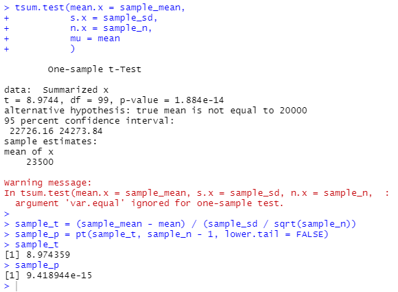
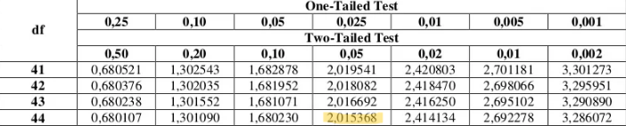
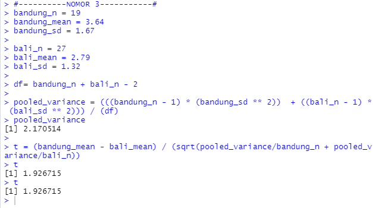
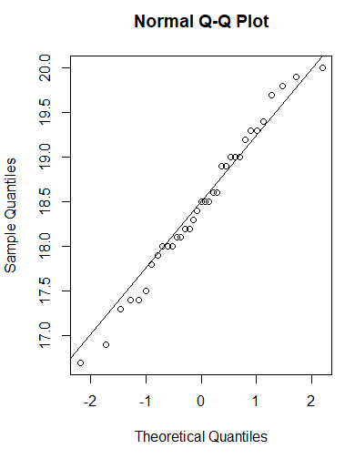
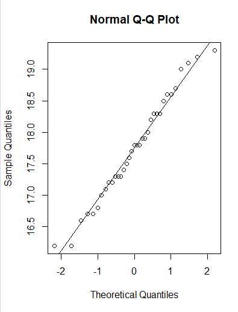
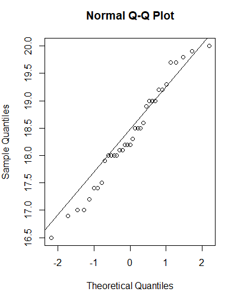
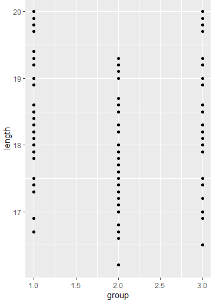

# P2_Probstat_A_5025201195
 
## Nomor 1
### Soal
Seorang peneliti melakukan penelitian mengenai pengaruh aktivitas A terhadap
kadar saturasi oksigen pada manusia. Peneliti tersebut mengambil sampel
sebanyak 9 responden. Pertama, sebelum melakukan aktivitas A, peneliti mencatat
kadar saturasi oksigen dari 9 responden tersebut. Kemudian, 9 responden tersebut
diminta melakukan aktivitas A. Setelah 15 menit, peneliti tersebut mencatat kembali
kadar saturasi oksigen dari 9 responden tersebut. Berikut data dari 9 responden
mengenai kadar saturasi oksigen sebelum dan sesudah melakukan aktivitas A


| Responden | x | y |
|:---------:|:-:|:-:|
|     1     | 78|100|
|     2     | 75| 95|
|     3     | 67| 70|
|     4     | 77| 90|
|     5     | 70| 90|
|     6     | 72| 90|
|     7     | 78| 89|
|     8     | 74| 90|
|     9     | 77|100|

Berdasarkan data pada tabel diatas, diketahui kadar saturasi oksigen dari
responden ke-3 ketika belum melakukan aktivitas A sebanyak 67, dan setelah
melakukan aktivitas A sebanyak 70.

+ `a.` Carilah Standar Deviasi dari data selisih pasangan pengamatan tabel
diatas

+ `b.` carilah nilai t (p-value)

+ `c.` tentukanlah apakah terdapat pengaruh yang signifikan secara statistika dalam hal kadar saturasi oksigen , sebelum dan sesudah melakukan aktivitas A jika diketahui tingkat signifikansi α = 5% serta H0 : “tidak ada pengaruh yang signifikan secara statistika dalam hal kadar saturasi oksigen, sebelum dan sesudah melakukan aktivitas A”

### Penyelesaian
+ `a.` Dibuat array berisi perubahan tingkat saturasi oksigen sebelum dan sesudah aktivitas A. Array tersebut dibuat dengan cara berikut:

    ```R
    col = 2
    row = 9

    ex_stats <- array(c(c(78, 75, 67, 77, 70, 72, 78, 74, 77)
                    , c(100, 95, 70, 90, 90, 90, 89, 90, 100))
                    , dim=c(row, col))

    o2_change <- array(c(0), dim=c(row, 1));
    for(i in 1:row){
    o2_change[i] <- ex_stats[i, 2] - ex_stats[i, 1] 
    }
    ```

    Setelah itu, digunakan fungsi yang terdapat dalam R untuk menghitung standard deviation, yaitu `sd()` yang dijalankan dengan cara berikut:

    ```R
    standard_deviation = sd(o2_change)
    ```

    Hasil standard deviation dari data yang tertera dalam tabel adalah seperti berikut:

    ```R
    > print(standard_deviation)
    [1] 6.359595
    > 
    ```

+ `b.` Untuk mencari nilai `t-score` digunakan ukuran sampel sebesar 5 yang diambil secara acak dengan cara seperti berikut:

    ```R
    sample_n <- 5

    sample_data <- sample(o2_change, sample_n)
    ```

    Sesuai dengan rumus: 
    $$\dfrac{({\mu}_{sample} - {\mu}_0)}{\sqrt{\dfrac{S^2_{sample}}{n}}}$$

    dicari nilai mean dari data asli dan data sampel serta nilai standard deviation dari data sampel yang dilakukan dengan cara berikut:

    ```R
    mean <- mean(o2_change)
    sample_mean <- mean(sample_data)
    sample_sd <- sd(sample_data)
    ```

    Dengan nilai-nilai yang ditemukan dimasukkan ke dalam rumus seperti berikut:

    ```R
    sample_t = (sample_mean - mean) / (sample_sd / sqrt(sample_n))
    ```

    Untuk mencari nilai p-value dari nilai t-score yang didapatkan sebelumnya, digunakan fungsi R yaitu `pt()` seperti berikut:

    ```R
    sample_p = pt(sample_t, sample_n - 1, lower.tail = TRUE)
    ```

+ `c.` Dibuat if-else statement untuk mengoutputkan verdict signifikansi berdasarkan nilai p-value seperti berikut: 

    ```R
    alpha <- 0.05
    if(sample_p > alpha){
    cat("Dengan:
    a) tingkat signifikansi alfa = 0.05
    b) hipotesa null = 'tidak ada pengaruh yang signifikan secara statistika dalam hal kadar saturasi oksigen, sebelum dan sesudah melakukan aktivitas A
    
    Dengan sampel: ", sample_data, "
    Didapatkan mean: ", sample_mean, "
    Didapatkan standard deviation: ", sample_sd, "
    Didapatkan t-score: ", sample_t, "
    Didapatkan p-value: ", sample_p, "
    
    Nilai p-value yang lebih dari alpha menandakan tidak ada pengaruh yang signifikan secara statistika sehingga null hipotesa dapat dibenarkan.")
    }else {
    cat("Dengan:
    a) tingkat signifikansi alfa = 0.05
    b) hipotesa null = 'tidak ada pengaruh yang signifikan secara statistika dalam hal kadar saturasi oksigen, sebelum dan sesudah melakukan aktivitas A
    
    Dengan sampel: ", sample_data, "
    Didapatkan mean: ", sample_mean, "
    Didapatkan standard deviation: ", sample_sd, "
    Didapatkan t-score: ", sample_t, "
    Didapatkan p-value: ", sample_p, "
    Nilai p-value yang kurang dari alpha menandakan ada pengaruh yang signifikan secara statistika sehingga null hipotesa salah.")
    }
    ```

### Dokumentasi
+ `a.`

    

+ `b.`

    

+ `c.`

    

## Nomor 2
### Soal
Diketahui bahwa mobil dikemudikan rata-rata lebih dari 20.000 kilometer per tahun.
Untuk menguji klaim ini, 100 pemilik mobil yang dipilih secara acak diminta untuk
mencatat jarak yang mereka tempuh. Jika sampel acak menunjukkan rata-rata
23.500 kilometer dan standar deviasi 3900 kilometer. (Kerjakan menggunakan
library seperti referensi pada modul).

+ `a.` Apakah Anda setuju dengan klaim tersebut?

+ `b.` Jelaskan maksud dari output yang dihasilkan!

+ `c.` Buatlah kesimpulan berdasarkan P-Value yang dihasilkan!

### Penyelesaian
+ `a.` Untuk menarik kesimpulan harus menguji nilai-nilai yang didapatkan dari populasi sampel. Ini dilakukan dengan cara berikut:

    ```R
    mean <- 20000
    sample_n <- 100
    sample_mean <- 23500
    sample_sd <- 3900

    tsum.test(mean.x = sample_mean, 
            s.x = sample_sd, 
            n.x = sample_n, 
            mu = mean
            )

    sample_t = (sample_mean - mean) / (sample_sd / sqrt(sample_n))
    sample_p = pt(sample_t, sample_n - 1, lower.tail = FALSE)
    sample_t
    sample_p
    ```

    Kesimpulan:
    ```
    Dapat ditarik kesimpulan bahwa null hypothesis benar karena berdasarkan hasil tsum.test() dengan terlihat bahwa 95% pengulangan test akan menghasilkan nilai rata-rata antara 22.726,16 dan 24.273,84 dengan batas bawah yang melebihi mean null hypothesis. 
    ```

+ `b.` Penjelasan output:
    ```
    Berdasarkan argumen yang diberikan pada fungsi dihasilkan t-score
    8.9744 menunjukkan jarak sebuah hasil dari rata-rata. Selain itu, p-score yang sangat mendekati nol menunjukkan signifikasi yang tinggi sehingga dapat dikatakan bahwa sampel menggambarkan keseluruhan populasi secara akurat. Interval keyakinan menunjukkan bahwa 95% pengulangan test akan menghasilkan nilai rata-rata antara 22.726,16 dan 24.273,84 
    ```

+ `c.` Analisis p-value:
  ```
  Nilai p yang jauh lebih rendah dari standar 0.05 menunjukkan bahwa hasil dari pengambilan sampel acak memiliki kemungkinan tinggi untuk terjadi. Oleh karena itu, dapat disimpulkan bahwa hasil dari pengambilan sampel acak dapat menggambarkan kondisi nyata dengan tingkat akurasi yang cukup tinggi
  ```

### Dokumentasi


## Nomor 3
### Soal
Diketahui perusahaan memiliki seorang data analyst ingin memecahkan
permasalahan pengambilan keputusan dalam perusahaan tersebut. Selanjutnya
didapatkanlah data berikut dari perusahaan saham tersebut.

| Nama Kota/Atribut      | Bandung | Bali |
|:----------------------:|:-------:|:----:|
| Jumlah Saham           | 19      | 27   |
| Sampel Mean            | 3.64    | 2.79 |
| Sampel Standar Deviasi | 1.67    | 1.32 |

Dari data di atas berilah keputusan serta kesimpulan yang didapatkan dari hasil di atas. Asumsikan nilai variansinya sama, apakah ada perbedaan pada rata-ratanya **($\alpha$ = 0.05)**? Buatlah:

+ `a.` $H_0$ dan $H_1$

+ `b.` Hitung sampel statistik

+ `c.` Lakukan uji statistik (df = 2)

+ `d.` Nilai kritikal

+ `e.` Keputusan

+ `f.` Kesimpulan

### Penyelesaian
+ `a.` 
  $$H_0 = "Rata-rata\:harga\:saham\:Bandung\:=\:harga\:saham\:Bali"$$
    $$H_1 = "Rata-rata\:harga\:saham\:Bandung\:\neq\:harga\:saham\:Bali"$$
  
+ `b.` Uji statistik dilakukan dengan pertama mencari nilai Variansi Sampel yang akan digunakan untuk mencari nilai `t-score` dari sampel. Hal itu dilakukan dengan cara berikut:

    ```R
    bandung_n = 19
    bandung_mean = 3.64
    bandung_sd = 1.67

    bali_n = 27
    bali_mean = 2.79 
    bali_sd = 1.32

    df= bandung_n + bali_n - 2

    pooled_variance = (((bandung_n - 1) * (bandung_sd ** 2))  + ((bali_n - 1) * (bali_sd ** 2))) / (df)
    pooled_variance

    t = (bandung_mean - bali_mean) / (sqrt(pooled_variance/bandung_n + pooled_variance/bali_n))
    t
    ```
  
    Rumus yang digunakan terdapat dua yaitu:
    $$(S_p)^2 = \dfrac{(n_1 - 1) * (S_1)^2 + (n_2 - 1) * (S_2)^2}{(n_1 - 1) + (n_2 - 1)}$$
    $$t = \dfrac{(\bar{X_1} - \bar{X_2})(\mu_1 - \mu_2)}{\sqrt{(S_p)^2(\dfrac{1}{n_1} + \dfrac{1}{n_2})}}$$

+ `c.`
  
+ `d.` Nilai kritikal dapat ditentukan dengan menggunakan ukuran sampel Bandung dan Bali serta nilai $\alpha$ dan menelusuri tabel-t untuk menemukan nilai kritikal. Pertama dihitung nilai `df`, yaitu:

$$df = (n_1 - 1) + (n_2 - 1)$$

Didapatkan nilai `v = 44` dengan nilai $\alpha = 0.05$ maka didapatkan nilai kritikal:



+ `e.` Terima $H_0$ pada $\alpha$ 
  
+ `f.` Uji statistik menghasilkan nilai t yang berada dalam rentang nilai kritikal
  
### Dokumentasi
+ 

## Nomor 4
### Soal
Seorang Peneliti sedang meneliti spesies dari kucing di ITS . Dalam penelitiannya
ia mengumpulkan data tiga spesies kucing yaitu kucing oren, kucing hitam dan
kucing putih dengan panjangnya masing-masing.
Jika :
diketahui dataset https://intip.in/datasetprobstat1
H0 : Tidak ada perbedaan panjang antara ketiga spesies atau rata-rata panjangnya
sama

Maka Kerjakan atau Carilah:
+ `a.` Buatlah masing masing jenis spesies menjadi 3 subjek "Grup" (grup 1,grup 2,grup 3). Lalu Gambarkan plot kuantil normal untuk setiap kelompok dan lihat apakah ada outlier utama dalam homogenitas varians.
  
+ `b.` Carilah atau periksalah Homogeneity of variances nya , Berapa nilai p yang didapatkan? Apa hipotesis dan kesimpulan yang dapat diambil?
  
+ `c.` Untuk uji ANOVA (satu arah), buatlah model linier dengan Panjang versus Grup dan beri nama model tersebut model 1.
  
+ `d.` Dari Hasil Poin C, Berapakah nilai-p? Apa yang dapat Anda simpulkan dari H0?
  
+ `e.` Verifikasilah jawaban model 1 dengan Post-hoc test Tukey HSD, dari nilai p yang didapatkan apakah satu jenis kucing lebih panjang dari yang lain? Jelaskan.
  
+ `f.` Visualisasikan data dengan ggplot2

### Penyelesaian
+ `a.` Untuk membuat memisah data yang diterima dari url menjadi masing-masing grup, digunakan teknik seperti berikut:

    ```R
    cat_data <- as.data.frame(read.table(url("https://rstatisticsandresearch.weebly.com/uploads/1/0/2/6/1026585/onewayanova.txt"), sep = "\t", header = T, col.names = c("group", "length")))

    group_1 <- cat_data[cat_data$group == "1", ]
    group_2 <- cat_data[cat_data$group == "2", ]
    group_3 <- cat_data[cat_data$group == "3", ]

    ```

    Selanjutnya setiap group visualisasikan dalam bentuk grafik dengan cara berikut:

    ```R
    qqnorm(y = group_1$length)
    qqline(y = group_1$length)
    qqnorm(y = group_2$length)
    qqline(y = group_2$length) 
    qqnorm(y = group_3$length) 
    qqline(y = group_3$length)
    ```

    Terakhir untuk menemukan outlier, dicari mean dari setiap grup dan mencari grup dengan mean yang memiliki mean yang berbeda jauh dengan yang lain. Hal itu dilakukan dengan cara berikut:

    ```R
    group_1_mean <- mean(group_1$length)
    group_2_mean <- mean(group_2$length)
    group_3_mean <- mean(group_3$length)
    ```

    Menghasilkan:
    
    ```R
    group_1_mean = 18.4657
    group_2_mean = 17.7457
    group_3_mean = 18.3628
    ```

    Dapat dilihat bahwa grup 2 merupakan outlier dengan nilai mean yang $\pm3%$ lebih kecil dari kedua grup lainnya.

+ `b.` Untuk menemukan outlier dalam homogeniety variance, dicari variansi dari ketiga grup dan mencari grup dengan variansi yang memiliki variansi yang berbeda jauh dengan yang lain. Hal itu dilakukan dengan cara berikut:

    ```R
    group_1_sd <- sd(group_1$length) ** 2
    group_2_sd <- sd(group_2$length) ** 2
    group_3_sd <- sd(group_3$length) ** 2
    ```

    Menghasilkan:
    
    ```R
    group_1 = 0.6994
    group_2 = 0.6961
    group_3 = 0.8477
    ```

    Dapat dilihat bahwa grup 3 merupakan outlier dengan nilai varians yang $\pm21%$ lebih besar dari kedua grup lainnya.

    Dengan menjalankan kode berikut:
    ```R
    # Compute the analysis of variance
    res.aov <- aov(length ~ group, data = cat_data)
    # Summary of the analysis
    summary(res.aov)
    ```

    Didapatkan:
    ```
                    Df Sum Sq Mean Sq F value Pr(>F)
    group         1   0.19  0.1851    0.22   0.64
    Residuals   103  86.70  0.8417      
    ```


    Nilai p dihitung dengan menggunakan fungsi `pf()` dengan argumen $F = \dfrac{0.1851}{0.841}$ dengan $df1 = 1$ dan $df2 = 103$. Didapatkan:

    ```
    p-value = 0.359902
    ```

    Terlihat bahwa nilai p-value lebih dari 0.05 sehingga dapat disimpulkan bahwa tidak ada perbedaan statistika yang signifikan antara ketiga grup kucing.


+ `c.` Model 1 dimuat dengan menggunakan fungsi `lm()` seperti berikut:
  
  ```R
  model_1 <- lm(cat_data$length ~ cat_data$group)
  ```

  Dihasilkan:
  ```
  Call:
    lm(formula = cat_data$length ~ cat_data$group)

    Residuals:
        Min      1Q  Median      3Q     Max 
    -1.9914 -0.7400 -0.0400  0.7571  1.8600 

    Coefficients:
                Estimate Std. Error t value Pr(>|t|)    
    (Intercept)    18.29429    0.23689  77.228   <2e-16 ***
    cat_data$group -0.05143    0.10966  -0.469     0.64    
    ---
    Signif. codes:  0 ‘***’ 0.001 ‘**’ 0.01 ‘*’ 0.05 ‘.’ 0.1 ‘ ’ 1

    Residual standard error: 0.9175 on 103 degrees of freedom
    Multiple R-squared:  0.002131,	Adjusted R-squared:  -0.007557 
    F-statistic:  0.22 on 1 and 103 DF,  p-value: 0.6401 
  ```

+ `d.` Dari nilai p-value yang didapatkan dari model linier dapat disimpulkan bahwa nilai p-value lebih dari 0.05 sehingga dapat disimpulkan bahwa tidak ada perbedaan statistika yang signifikan antara ketiga grup kucing.

+ `e.` `TukeyHSD()` dipanggil dengan memberi argumen dari hasil fungsi `aov()` sebelumnya seperti berikut:
    ```R
    TukeyHSD(res.aov)
    ```

    Didapatkan output seperti berikut:
    ```
              diff        lwr        upr     p adj
    2-1 -0.7200000 -1.2116284 -0.2283716 0.0020955
    3-1 -0.1028571 -0.5944855  0.3887713 0.8726158
    3-2  0.6171429  0.1255145  1.1087713 0.0098353

    ```

    Dilihat bahwa setiap pasangan yang mengandung grup 2 memiliki nilai p yang sangat kecil. Hal ini menunjukkan bahwa ada perbedaan statistika yang cukup signifikan antara grup 2 dengan grup lainnya. Dari hasil mean setiap grup dapat disimpulkan bahwa grup 2 merupakan jenis kucing yang lebih pendek. Oleh karena itu, $H_0$ dapat disalahkan karena ada perbedaan panjang.
  
+ `f.` Dilakukan dengan cara berikut:
    ```R
    install.packages("tidyverse")
    library(ggplot2)

    ggplot(data = cat_data, mapping = aes(x=group, y=length)) + geom_point()
    ```

### Dokumentasi
+ `a.` 
  + grup 1

    

  + grup 2
  
    

  + grup 3
    
    

+ `f.`
    
    

## Nomor 5
### Soal
+`a.`
+`b.`
+`c.`
+`d.`
+`e.`
### Penyelesaian
+`a.`
+`b.`
+`c.`
+`d.`
+`e.`
### Dokumentasi
+`a.`
+`b.`
+`c.`
+`d.`
+`e.`