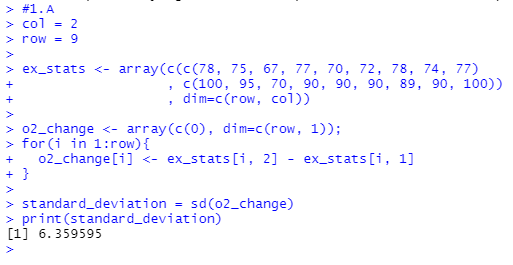
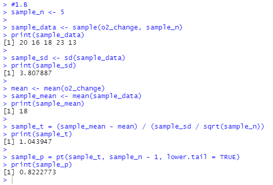
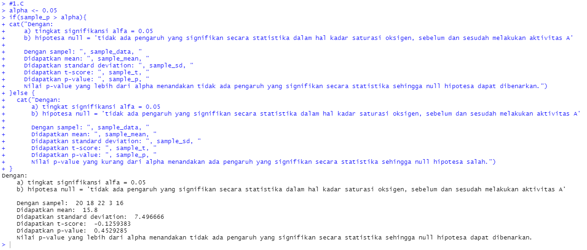

# P2_Probstat_A_5025201195
 
## Nomor 1
### Soal
Seorang peneliti melakukan penelitian mengenai pengaruh aktivitas A terhadap
kadar saturasi oksigen pada manusia. Peneliti tersebut mengambil sampel
sebanyak 9 responden. Pertama, sebelum melakukan aktivitas A, peneliti mencatat
kadar saturasi oksigen dari 9 responden tersebut. Kemudian, 9 responden tersebut
diminta melakukan aktivitas A. Setelah 15 menit, peneliti tersebut mencatat kembali
kadar saturasi oksigen dari 9 responden tersebut. Berikut data dari 9 responden
mengenai kadar saturasi oksigen sebelum dan sesudah melakukan aktivitas A


| Responden | x | y |
|:---------:|:-:|:-:|
|     1     | 78|100|
|     2     | 75| 95|
|     3     | 67| 70|
|     4     | 77| 90|
|     5     | 70| 90|
|     6     | 72| 90|
|     7     | 78| 89|
|     8     | 74| 90|
|     9     | 77|100|

Berdasarkan data pada tabel diatas, diketahui kadar saturasi oksigen dari
responden ke-3 ketika belum melakukan aktivitas A sebanyak 67, dan setelah
melakukan aktivitas A sebanyak 70.

+`a.` Carilah Standar Deviasi dari data selisih pasangan pengamatan tabel
diatas

+`b.` carilah nilai t (p-value)

+`c.` tentukanlah apakah terdapat pengaruh yang signifikan secara statistika
dalam hal kadar saturasi oksigen , sebelum dan sesudah melakukan
aktivitas A jika diketahui tingkat signifikansi α = 5% serta H0 : “tidak ada
pengaruh yang signifikan secara statistika dalam hal kadar saturasi
oksigen , sebelum dan sesudah melakukan aktivitas A”

### Penyelesaian
+ `a.` Dibuat array berisi perubahan tingkat saturasi oksigen sebelum dan sesudah aktivitas A. Array tersebut dibuat dengan cara berikut:

    ```R
    col = 2
    row = 9

    ex_stats <- array(c(c(78, 75, 67, 77, 70, 72, 78, 74, 77)
                    , c(100, 95, 70, 90, 90, 90, 89, 90, 100))
                    , dim=c(row, col))

    o2_change <- array(c(0), dim=c(row, 1));
    for(i in 1:row){
    o2_change[i] <- ex_stats[i, 2] - ex_stats[i, 1] 
    }
    ```

    Setelah itu, digunakan fungsi yang terdapat dalam R untuk menghitung standard deviation, yaitu `sd()` yang dijalankan dengan cara berikut:

    ```R
    standard_deviation = sd(o2_change)
    ```

    Hasil standard deviation dari data yang tertera dalam tabel adalah seperti berikut:

    ```R
    > print(standard_deviation)
    [1] 6.359595
    > 
    ```

+ `b.` Untuk mencari nilai `t-score` digunakan ukuran sampel sebesar 5 yang diambil secara acak dengan cara seperti berikut:

    ```R
    sample_n <- 5

    sample_data <- sample(o2_change, sample_n)
    ```

    Sesuai dengan rumus: 
    $$\dfrac{({\mu}_{sample} - {\mu}_0)}{\sqrt{\dfrac{S^2_{sample}}{n}}}$$

    dicari nilai mean dari data asli dan data sampel serta nilai standard deviation dari data sampel yang dilakukan dengan cara berikut:

    ```R
    mean <- mean(o2_change)
    sample_mean <- mean(sample_data)
    sample_sd <- sd(sample_data)
    ```

    Dengan nilai-nilai yang ditemukan dimasukkan ke dalam rumus seperti berikut:

    ```R
    sample_t = (sample_mean - mean) / (sample_sd / sqrt(sample_n))
    ```

    Untuk mencari nilai p-value dari nilai t-score yang didapatkan sebelumnya, digunakan fungsi R yaitu `pt()` seperti berikut:

    ```R
    sample_p = pt(sample_t, sample_n - 1, lower.tail = TRUE)
    ```

+ `c.` Dibuat if-else statement untuk mengoutputkan verdict signifikansi berdasarkan nilai p-value seperti berikut: 

    ```R
    alpha <- 0.05
    if(sample_p > alpha){
    cat("Dengan:
    a) tingkat signifikansi alfa = 0.05
    b) hipotesa null = 'tidak ada pengaruh yang signifikan secara statistika dalam hal kadar saturasi oksigen, sebelum dan sesudah melakukan aktivitas A
    
    Dengan sampel: ", sample_data, "
    Didapatkan mean: ", sample_mean, "
    Didapatkan standard deviation: ", sample_sd, "
    Didapatkan t-score: ", sample_t, "
    Didapatkan p-value: ", sample_p, "
    
    Nilai p-value yang lebih dari alpha menandakan tidak ada pengaruh yang signifikan secara statistika sehingga null hipotesa dapat dibenarkan.")
    }else {
    cat("Dengan:
    a) tingkat signifikansi alfa = 0.05
    b) hipotesa null = 'tidak ada pengaruh yang signifikan secara statistika dalam hal kadar saturasi oksigen, sebelum dan sesudah melakukan aktivitas A
    
    Dengan sampel: ", sample_data, "
    Didapatkan mean: ", sample_mean, "
    Didapatkan standard deviation: ", sample_sd, "
    Didapatkan t-score: ", sample_t, "
    Didapatkan p-value: ", sample_p, "
    Nilai p-value yang kurang dari alpha menandakan ada pengaruh yang signifikan secara statistika sehingga null hipotesa salah.")
    }
    ```

### Dokumentasi
+`a.`



+`b.`



+`c.`



## Nomor 2
### Soal
+`a.`

+`b.`

+`c.`

### Penyelesaian
+`a.`
+`b.`
+`c.`
### Dokumentasi
+`a.`
+`b.`
+`c.`

## Nomor 3
### Soal
+`a.`
+`b.`
+`c.`
+`d.`
+`e.`
+`f.`
### Penyelesaian
+`a.`
+`b.`
+`c.`
+`d.`
+`e.`
+`f.`
### Dokumentasi
+`a.`
+`b.`
+`c.`
+`d.`
+`e.`
+`f.`

## Nomor 4
### Soal
+`a.`
+`b.`
+`c.`
+`d.`
+`e.`
+`f.`
### Penyelesaian
+`a.`
+`b.`
+`c.`
+`d.`
+`e.`
+`f.`
### Dokumentasi
+`a.`
+`b.`
+`c.`
+`d.`
+`e.`
+`f.`

## Nomor 5
### Soal
+`a.`
+`b.`
+`c.`
+`d.`
+`e.`
### Penyelesaian
+`a.`
+`b.`
+`c.`
+`d.`
+`e.`
### Dokumentasi
+`a.`
+`b.`
+`c.`
+`d.`
+`e.`